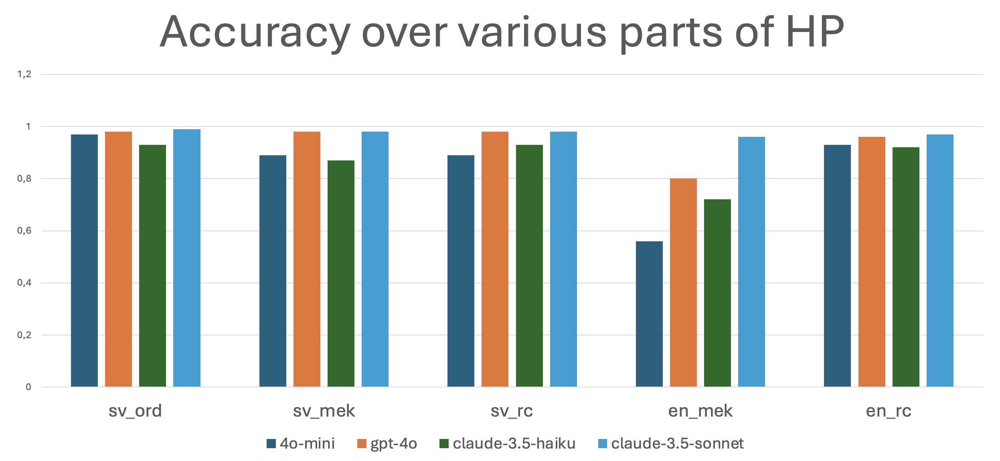
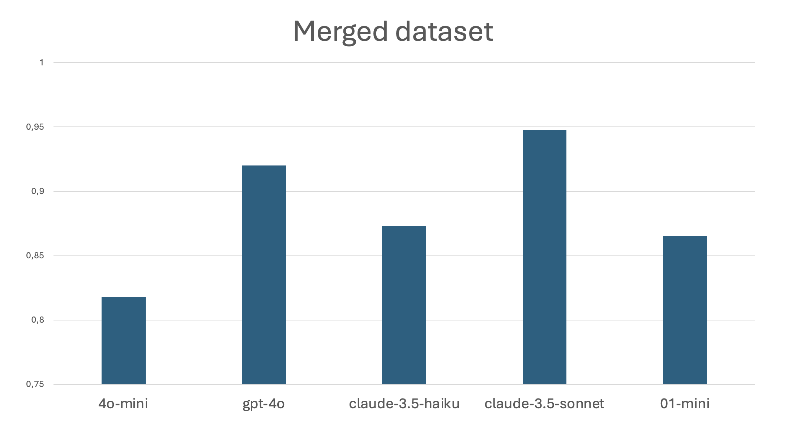

# 📚 LLMs vs. SweSAT – Andon Labs Hackathon 2025
This repo contains our work from the [Andon Labs Hackathon at Linköping University](https://www.facebook.com/events/947993350302617/), where we evaluated LLMs on SweSAT (Högskoleprovet) question types.

## 🧠 Models Evaluated
- `openai/gpt-4o-mini`
- `openai/gpt-4o`
- `anthropic/claude-3-5-haiku-latest`
- `anthropic/claude-3-5-sonnet-latest`
- `o1-mini`

## 📄 Dataset
Questions sourced from:  👉 [github.com/ViktorAlm/HP](https://github.com/ViktorAlm/HP)

Covers:
- Reading Comprehension (RC) – SV & EN  
- Sentence Completion (MEK) – SV & EN  
- Vocabulary (Words) – SV only

## 📊 Results
**Detailed Performance**

**Aggregated Accuracy**

## 🏆 Findings
- GPT-4o and Claude 3.5 Sonnet consistently outperformed others.
- LLMs are nearing human-level performance on standardized tests.
- Prompt quality had a notable impact on accuracy.

## 📌 Summary
Can an LLM pass the SweSAT? For some question types, yes—especially with the right prompt and a top-tier model.
